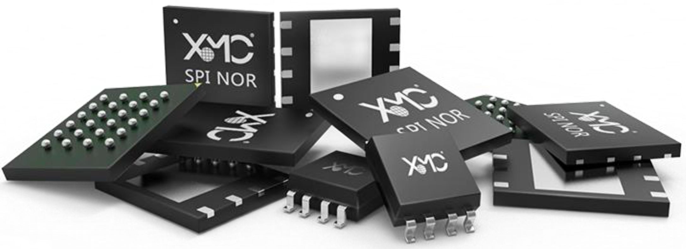

# SPI FLASH 分析工具




[English](readme_en.md) | [中文](./readme.md)

在物联网嵌入式设备场景中，存储非易失性数据，常见会使用SPI FLASH，对于SPI FLASH问题的分析，我们需要有一个专用的分析工具，能够快速对FLASH进行数据分析。通过这个工具，可以读取FLASH ID，确认客户在使用的厂商和型号，工具支持使用命令行对FLASH芯片进行擦除、写入、读取、校验功能。

另外说明，为了遵循高效开发和维护的原则，作者不希望去实时维护一份FLASH驱动，故我们的FLASH分析工具，会直接引用乐鑫提供的驱动工具，基于乐鑫驱动工具，进行二次封装，满足我们对FLASH的分析需求

------

## 特性规格

| 规格     | 详细描述                                                     |
| -------- | ------------------------------------------------------------ |
| 标识读取 | 读取ID，辨识厂商、型号，以确认客户目前正在使用的FLASH厂商和具体型号 |
| 数据擦除 | 支持整片擦除，支持指定区域擦除                               |
| 数据写入 | 数据或者文件，写入到FLASH指定区域                            |
| 数据读取 | 读取FLASH中的指定区域，保存成文件                            |
| 数据校验 | 通过数据写入和检验，看数据的一致性                           |
| 容量获取 | 读取容量大小                                                 |
| 时间获取 | 获得擦除时间、读取时间、写入时间，以用于评估性能影响         |
| 测试模型 | 支持多种常见的FLASH测试模型，包括EECO和EOCE等模型            |

## 实现原理

基于乐鑫的FLASH驱动工具，添加测试用例脚本，二次封装成一个专用于FLASH的分析工具，目前仅支持命令行模式，支持在Linux平台下使用，支持多线程场景

## 安装步骤

请按照以下步骤安装和配置项目：

克隆仓库：

```bash
git clone git@github.com:zifengchenll/spi_flash_debug_tools.git
```

进入目录：

```bash
cd spi_flash_debug_tools/
```

## 使用说明

使用帮助指令，打印各个命令行的用途和使用方法

```
./debug_cmd.sh help
```

启用单扇区擦写校验测试模型

```
./debug_cmd.sh single_read_write_check
```

启用EECO测试模型（EECO（Erase Even sector, Check Odd sector VT）：对全片编程0x00后，擦除偶数扇区，并检查奇数扇区的验证测试）

```
./debug_cmd.sh eeco
```

进行EOCE测试模型（EOCE（Erase Odd sector, Check Even sector VT）：对全片编程0x00后，擦除奇数扇区，并检查偶数扇区的验证测试）

```
./debug_cmd.sh eoce
```

读取FLASHID

```
./debug_cmd.sh flash_id
```

整片硬存擦除，可以显示擦除耗时

```
./debug_cmd.sh erase_flash
```

要擦除硬存的某个区域，起始地址是0x20000，长度为0x4000字节

```
./debug_cmd.sh erase_region 0x20000 0x4000
```

将二进制数据通过/dev/ttyUSB0写入硬存，写入地址0x1000开始

```
./debug_cmd.sh -p /dev/ttyUSB0 write_flash 0x1000 ./flash_bin/zero_4k_file
```

将硬存中数据通过/dev/ttyUSB0串口读出，使用的波特率是460800，起始地址0，长度0x200000，保存的文件名flash_contents.bin

```
./debug_cmd.sh -p /dev/ttyUSB0 -b 460800 read_flash 0 0x200000 flash_contents.bin
```

将硬存中数据通过/dev/ttyUSB0串口读出，使用的波特率是460800，起始地址0，长度硬存容量，保存的文件名flash_contents.bin

```
./debug_cmd.sh -p /dev/ttyUSB0 -b 460800 read_flash 0 ALL flash_contents.bin
```

写状态寄存器， --bytes决定了写入多少个状态寄存器字节，分别对应WRSR(01h)，WRSR2(31h)，WRSR3(11h)

```
./debug_cmd.sh write_flash_status --bytes 2 --non-volatile 0
```

读状态寄存器，--bytes决定了读取多少个状态寄存器字节，分别对应RDSR(05h)，RDSR2(35h)，RDSR3(15h)

```
./debug_cmd.sh read_flash_status  --bytes 2
```

## 测试说明

支持的测试模型：

```
./debug_cmd.sh eeco
./debug_cmd.sh eoce
```

## 项目结构

```bash
.
├── debug_cmd.sh			//执行命令
├── debug_temp				//缓存目录
├── docs					//文档目录
│   └── images
├── flash_bin				//实验文件
│   ├── zero_16mb_file
│   ├── zero_1mb_file
│   ├── zero_2mb_file
│   ├── zero_4k_file
│   ├── zero_4mb_file
│   └── zero_8mb_file
├── license
├── readme_en.md
├── readme.md
├── test_case				//预留目录
└── tools					//工具目录
    ├── esptool				//乐鑫工具
    └── flash_id			//用于查询厂商ID和芯片型号

```

## 注意事项

如果配置状态寄存器，一定要注意正确性，某些寄存器配置是非易失性的，可能产生永久影响

## 参考文献

- [乐鑫驱动：https://github.com/espressif/esptool](https://github.com/espressif/esptool)
